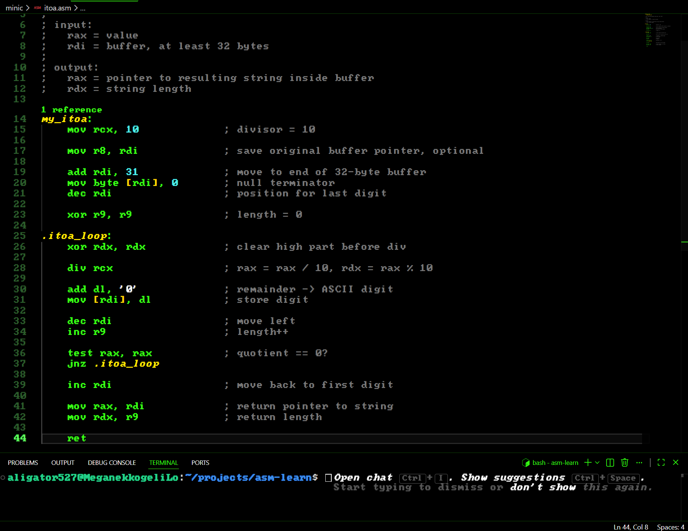

nasm-learn
=========

A small learning repository for x86-64 assembly on Linux.

The project contains simple NASM programs that call Linux syscalls directly, plus a tiny C-like library implemented in assembly and exercised from C programs.

## What Is Inside

- `hello.asm` - prints `Hello, Assembly!` using the `write` syscall.
- `input.asm` - reads text from standard input and prints it back.
- `add.asm` - reads two numbers, converts them, adds them, and prints the result.
- `reverse.asm` - reads text and prints it reversed.
- `strcmp.asm` - standalone string comparison exercise.
- `minic/` - small libc-style routines written in assembly:
  - `my_strlen`
  - `my_strcmp`
  - `my_strcpy`
  - `my_memcpy`
  - `my_memset`
  - `my_atoi`
  - `my_itoa`
- `algorithms/` - algorithms written in assembly:
  - `bubblesort.asm`
  - `quicksort.asm`
  - `binarysearch.asm`
  - `linearsearch.asm`
  - `selectionsort.asm`
  - `insertionsort.asm`
  - `mergesort.asm`
- `use*.c` - small C programs that link against selected routines from `minic/` and `algorithms/`.

This is an educational project, not a production C library. The code favors readability and step-by-step learning over full standard-library compatibility.

## Requirements

- Linux x86-64
- [NASM](https://www.nasm.us/)
- GCC
- GNU binutils (`ld`)

On Debian or Ubuntu:

```sh
sudo apt update
sudo apt install nasm gcc binutils
```

## Build And Run

### Standalone Assembly Program

Build a program that defines `_start`, such as `hello.asm`:

```sh
nasm -f elf64 hello.asm -o hello.o
ld hello.o -o hello
./hello
```

You can use the same pattern for other standalone files:

```sh
nasm -f elf64 reverse.asm -o reverse.o
ld reverse.o -o reverse
./reverse
```

### Assembly Routine Called From C

Build an assembly routine as an object file, then link it with a C example:

```sh
nasm -f elf64 minic/memset.asm -o memset.o
gcc useMemset.c memset.o -o useMemset
./useMemset
```

More examples:

```sh
nasm -f elf64 minic/memcpy.asm -o memcpy.o
gcc useMemcpy.c memcpy.o -o useMemcpy
./useMemcpy
```

```sh
nasm -f elf64 minic/strlen.asm -o strlen.o
gcc useStrlen.c strlen.o -o useStrlen
./useStrlen
```

## VS Code

This repository includes VS Code tasks in `.vscode/tasks.json`.

Use `Ctrl+Shift+B` and choose one of:

- `Run Assembly` - builds and runs the currently opened standalone assembly file.
- `Run C with selected ASM` - asks which `.asm` files to assemble, then links them with the currently opened C file.

## Linux Syscall Calling Convention

For direct Linux syscalls on x86-64:

| Register | Purpose |
| --- | --- |
| `rax` | syscall number |
| `rdi` | argument 1 |
| `rsi` | argument 2 |
| `rdx` | argument 3 |
| `r10` | argument 4 |
| `r8` | argument 5 |
| `r9` | argument 6 |

Example: `write(1, msg, len)`:

```asm
mov rax, 1      ; syscall: write
mov rdi, 1      ; fd: stdout
mov rsi, msg    ; buffer
mov rdx, len    ; byte count
syscall
```

To see syscall numbers for your local system:

```sh
cat /usr/include/asm/unistd_64.h
```

## Project Status

This repository is a work in progress for assembly practice. Some files are complete examples, while others are experiments or placeholders for future algorithms.

Planned exercises include:

- More algorithms
- Dynamic memory allocation (`malloc`)
- Additional libc-style routines
- Brainfuck interpreter
- Lisp interpreter
- CHIP-8 emulator
- Graphics experiments
  - PPM/BMP renderer
  - ANSI terminal graphics
  - 2D renderer
  - Sprite engine
  - Raycaster
  - Mini Doom-like engine

## Philosophy

This repository prioritizes:

- readability over clever tricks;
- learning over optimization;
- explicit code over macro magic;
- understanding the ABI and Linux syscalls from first principles.

## Style of VSCode



I use a retro green-on-black VS Code style like in the screenshot because I like the IBM PC 5150 feeling while writing NASM :D

To get the same look:

1. Install the `Ac437 IBM BIOS` font, or replace it in `.vscode/settings.json` with another IBM-style bitmap font.
2. Install a dark terminal-like color theme. The current settings use `Hacker X - Terminal Zero`.
3. If you want the CRT scanline effect, install a custom CSS loader extension for VS Code and point `vscode_custom_css.imports` to the CSS file in `.vscode/style.css`.
4. Reload VS Code after changing the font, theme, or custom CSS settings.

The visual settings live in `.vscode/settings.json`. They are only for appearance; the build tasks are in `.vscode/tasks.json`.

If you do not want this style, delete everything in `.vscode` except `tasks.json`.

I got `Ac437 IBM BIOS` font from `VileR` here: https://int10h.org/oldschool-pc-fonts/fontlist/?1

Also, `Hacker X - Terminal Zero` theme from `Hasibur R` here: https://marketplace.visualstudio.com/items?itemName=HasiburR.dark-hacker-theme-by-hasibur-r

## Contributing

Suggestions, corrections, and small learning-focused examples are welcome. Please keep examples simple and readable, with comments that help beginners understand what each register and syscall is doing.
